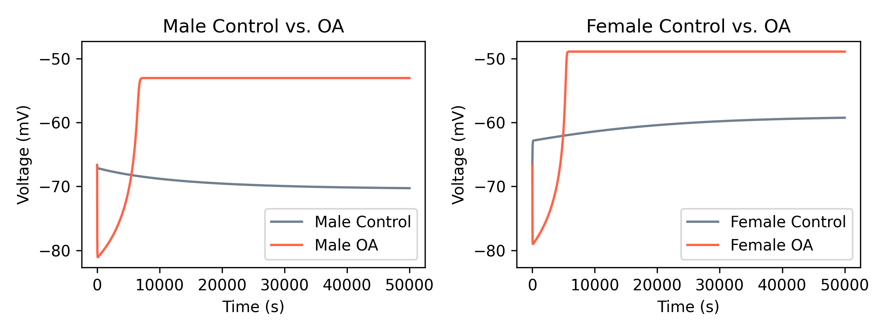

# Instruction

1. Open generate_population.py, edit configs then run 
2. Open desired analysis script, edit configs then run

# Example outputs

**sensitivity_analysis.py**

**plot_population.py**

**compare_male_and_female_lineplot.py**

**compare_male_and_female_population_barplot**

